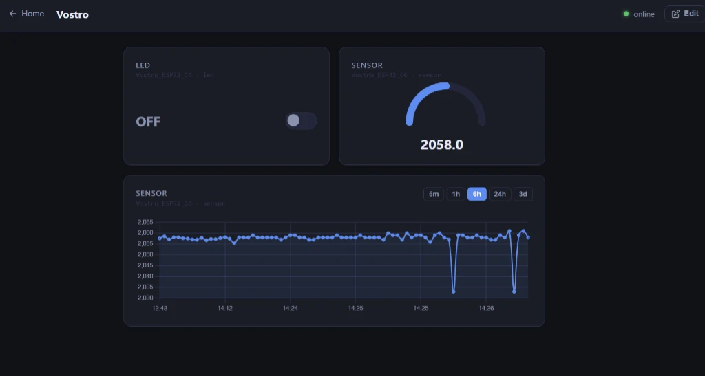

# HomeLab — Classroom IoT Dashboard

A self-hosted, student-friendly IoT dashboard platform - like Blynk, but runs on your classroom laptop with no internet required.



---

## What it does

- Each student creates their own dashboard in a web browser
- They drag-and-drop widgets (Switch, Slider, Gauge, Graph) onto a canvas
- Each widget is linked to a **pin name** on the student's ESP32
- The ESP32 sends sensor data and receives control commands automatically
- Everything runs on one laptop - no cloud, no login required

---

## Architecture 

```
[ ESP32 ] ←── MQTT ──→ [ Node.js Server (embedded broker) ] ←── WebSocket ──→ [ Browser ]
```

The server is both the MQTT broker **and** the web server. No separate Mosquitto install needed.

---

## Server Setup

### Requirements
- [Node.js 18+](https://nodejs.org/) installed on the laptop
- The laptop and all ESP32s must be on the **same WiFi network**

### Install

```bash
# 1. Clone / copy this project folder to the laptop
cd homelab-server

# 2. Install dependencies
npm install

# 3. Start the server
npm start
```

You will see output like:
```
[MQTT] Broker listening on port 1883
[HTTP] Server running at http://localhost:3000
[HTTP] Network access: http://192.168.1.50:3000
[MQTT] ESP32 broker IP for students: 192.168.1.50:1883
```

Note the **Network access IP** - students need this for their ESP32 code.

### Run in development (auto-restart on file changes)

```bash
npm run dev
```

### Run when deploying for classroom, no SaaS app active editing

```bash
npm start
```

### Find your laptop's IP address

**Windows:** Open Command Prompt → `ipconfig` → look for **IPv4 Address** under your WiFi adapter  
**Linux/Mac:** Open Terminal → `ip addr` or `ifconfig` → look for `inet` under your WiFi interface

---

## Using the Dashboard

### Teacher setup (once)

1. Open `http://localhost:3000` in a browser
2. Click **Manage Devices** → register one device per student group
3. Note the generated **Auth Token** for each device - give it to the student

### Student workflow

1. Go to `http://<laptop-ip>:3000` on any device on the classroom network
2. Click **Create** and enter your name (e.g. *Alice's Plant Monitor*)
3. Click your dashboard to open it
4. Click **Edit → Add Widget** to add cards
5. Pick widget type, enter a label, select your device, and type a pin name
6. Click **Done** when finished

---

## ESP32 Setup

### Required Arduino library

Install from the Arduino Library Manager:
- **PubSubClient** by Nick O'Leary

Then copy the `arduino/homelab_esp32/` folder into your Arduino `libraries/` folder:

| OS      | Libraries folder                              |
|---------|-----------------------------------------------|
| Windows | `Documents\Arduino\libraries\`                |
| Linux   | `~/Arduino/libraries/`                        |
| macOS   | `~/Documents/Arduino/libraries/`              |

### Student code template

```cpp
#include <homelab_esp32.h>

const char* WIFI_SSID     = "ClassroomWiFi";
const char* WIFI_PASSWORD = "wifipassword";
const char* AUTH_TOKEN    = "abc123def456";    // from the Devices page
const char* SERVER_IP     = "192.168.1.50";    // laptop IP shown on startup

void setup() {
  Serial.begin(115200);
  Homelab.begin(WIFI_SSID, WIFI_PASSWORD, AUTH_TOKEN, SERVER_IP);
}

void loop() {
  Homelab.loop();  // always first

  // Send a sensor value (shows on Graph/Gauge widgets)
  Homelab.publishSensor("temperature", 23.5);

  // Read a control value (from Switch/Slider widgets)
  float brightness = Homelab.getControl("led_dim");
  bool  relayOn    = Homelab.getControl("relay") != 0;

  delay(2000);
}
```

### Example sketches

| Sketch | What it demonstrates |
|--------|---------------------|
| `arduino/homelab_esp32/examples/basic_sensor/` | Publishing sensor data to graph + gauge |
| `arduino/homelab_esp32/examples/relay_control/` | Reading switch + slider from dashboard |

---

## Widget Reference

| Widget | ESP32 side | Dashboard side |
|--------|-----------|----------------|
| **Switch** | `getControl("pin")` returns `1.0` or `0.0` | Toggle button, ON/OFF label |
| **Slider** | `getControl("pin")` returns `0`–`255` (or custom range) | Drag slider |
| **Gauge**  | `publishSensor("pin", value)` | Animated half-circle dial |
| **Graph**  | `publishSensor("pin", value)` | Scrolling line chart (last 60 points live, 500 stored) |

**Pin names** are free-form strings - use anything descriptive: `temperature`, `relay1`, `led_dim`, `soil_moisture`.

---

## Project Structure

```
homelab-server/
├── server/
│   ├── index.js          ← Express + embedded MQTT broker + WebSocket relay
│   ├── db.js             ← SQLite schema and prepared statements
│   └── routes/
│       ├── dashboards.js
│       ├── devices.js
│       └── widgets.js
├── public/
│   ├── index.html        ← Dashboard list page
│   ├── dash.html         ← Individual dashboard (view + edit mode)
│   └── js/
│       ├── widgets.js    ← Renders the 4 widget card types
│       └── dashboard.js  ← Grid, drag-drop, WebSocket live updates
├── arduino/
│   └── homelab_esp32/    ← Arduino library (copy to libraries folder)
│       ├── homelab_esp32.h
│       ├── homelab_esp32.cpp
│       ├── library.properties
│       └── examples/
│           ├── basic_sensor/
│           └── relay_control/
├── data/
│   └── homelab.db        ← SQLite database (auto-created on first run)
├── package.json
└── README.md
```

---

## Troubleshooting

**ESP32 won't connect to MQTT**
- Check that `SERVER_IP` matches your laptop's IP (it changes when you change networks)
- Make sure the Node.js server is running (`npm start`)
- Check that the ESP32 and laptop are on the same WiFi network
- Try pinging the laptop from a phone on the same WiFi

**Dashboard not updating**
- Check the device dot in the header - it should be green when the ESP32 is connected
- Open browser DevTools → Console for WebSocket errors
- Make sure the pin name in the widget matches exactly what you call `publishSensor()` with

**Port conflict on startup**
- Another app is using port 3000 or 1883
- Change `HTTP_PORT=3001 npm start` or set `MQTT_PORT=1884 npm start`

---

## License

MIT - free to use, modify, and share in classrooms.
